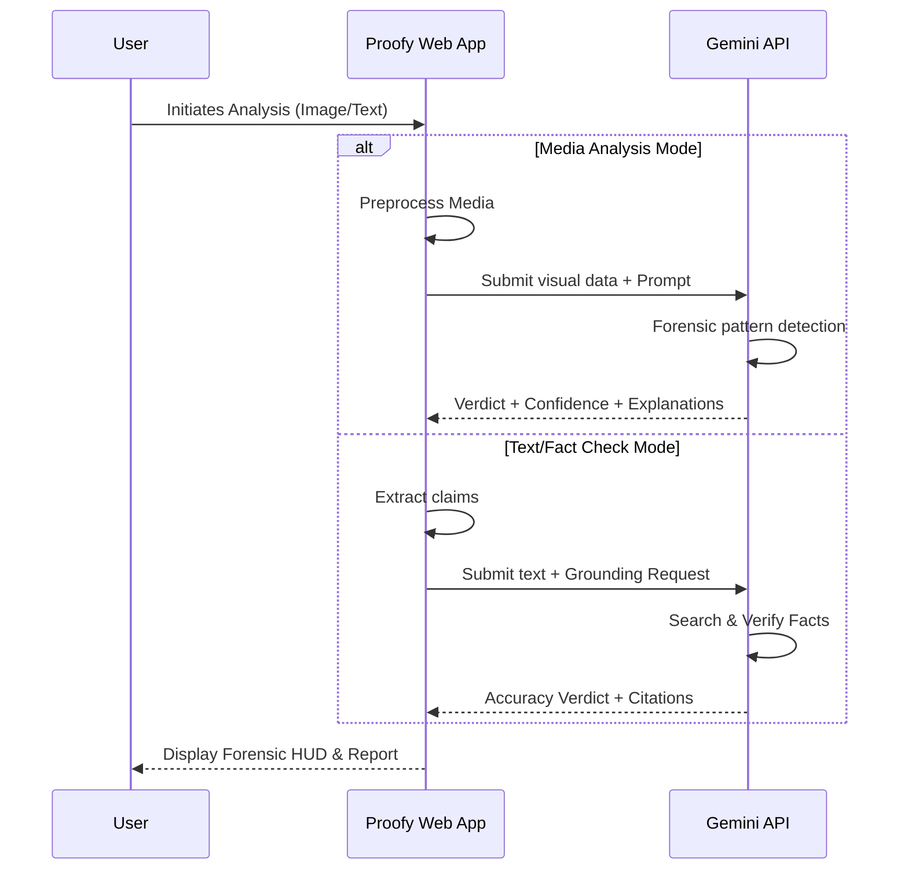

  

<h1 align="center">Proofy</h1>

  <b>Neural Forensic Verification Suite</b> 
  A Web Application that detects AI-generated media, verifies claims, and provides auditable forensic intelligence in real-time.

  <a href="#features">Features</a> •
  <a href="#how-it-works">How It Works</a> •
  <a href="#usage">Usage</a> •
  <a href="#technical-specifications">Technical Specifications</a>

---

## Overview

Proofy is a high-fidelity deepfake detection platform designed for the average user. Using advanced AI models, it analyzes visual and textual content to determine authenticity, helping users make informed decisions about the media they consume.

**Key Capabilities:**
- Image analysis for detecting synthetic media
- Text analysis for detecting AI-generated content
- Source analysis for finding the origin of media
- Real-time processing: Rapid analysis with confidence scoring and detailed reasoning.

---

## Features

### Image Analysis
Analyzes images and videos for subtle indicators of AI generation, including:
- GAN artifacts and frequency domain anomalies
- Diffusion model inconsistencies (e.g., asymmetrical pupils, unnatural textures)
- Subsurface scattering irregularities on skin
- Temporal flow analysis for video deepfakes

### Text Analysis
Evaluates textual claims by:
- identifying "synthetic fingerprints" and linguistic markers
- Cross-referencing claims against real-time global data via Google Search
- Detecting logical inconsistencies and misinformation patterns

### Source Finder (Reverse Grounding)
- Upload media to discover its origin and context
- Integrity checks to highlight potential unauthorized modifications

### Batch Triage
- Parallel processing of multiple files
- CSV/TXT export for large-scale investigations

---

## How It Works

---

## Usage

| Function | Description |
|----------|-------------|
| **Image Analysis** | Deep-scan images/video for synthetic indicators |
| **Text Analysis** | Verify claims and detect AI-written content |
| **Source Finder** | Reverse search media to find its origin |
| **Batch Triage** | Process multiple files simultaneously |

### Understanding Results

| Verdict | Meaning |
|---------|---------|
| **REAL** | No synthetic indicators detected; high confidence in authenticity |
| **LIKELY_FAKE** | Significant anomalies found; high probability of AI generation |
| **SUSPICIOUS** | Potential anomalies detected — manual review recommended |
| **DISPUTED** | Claims contradict established facts or lack evidence |

---

## Technical Specifications

| Component | Technology |
|-----------|------------|
| Platform | Web Application (Vite) |
| Frontend | React 19, TypeScript, Tailwind CSS |
| Animations | Framer Motion |
| AI Backend | Google Gemini Pro 1.5 / Flash 2.0 |
| Grounding | Google Search Tool Integration |

---

## License

This project is licensed under the MIT License.

---

  Real Media needs Real Proof.

