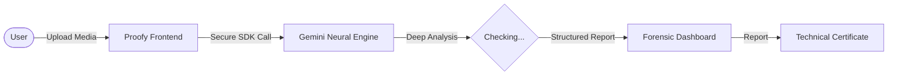
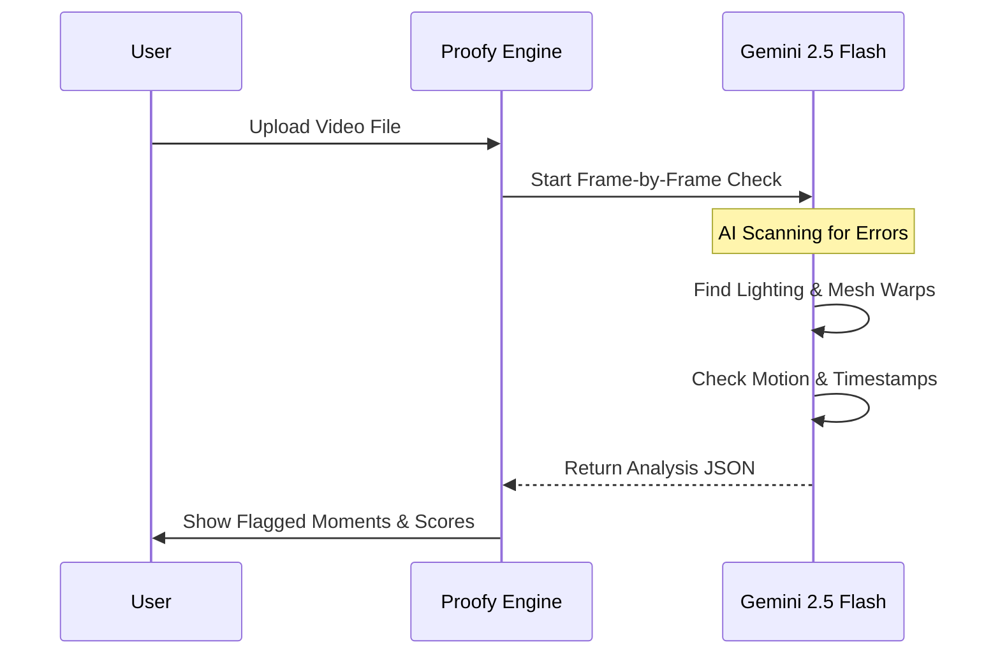
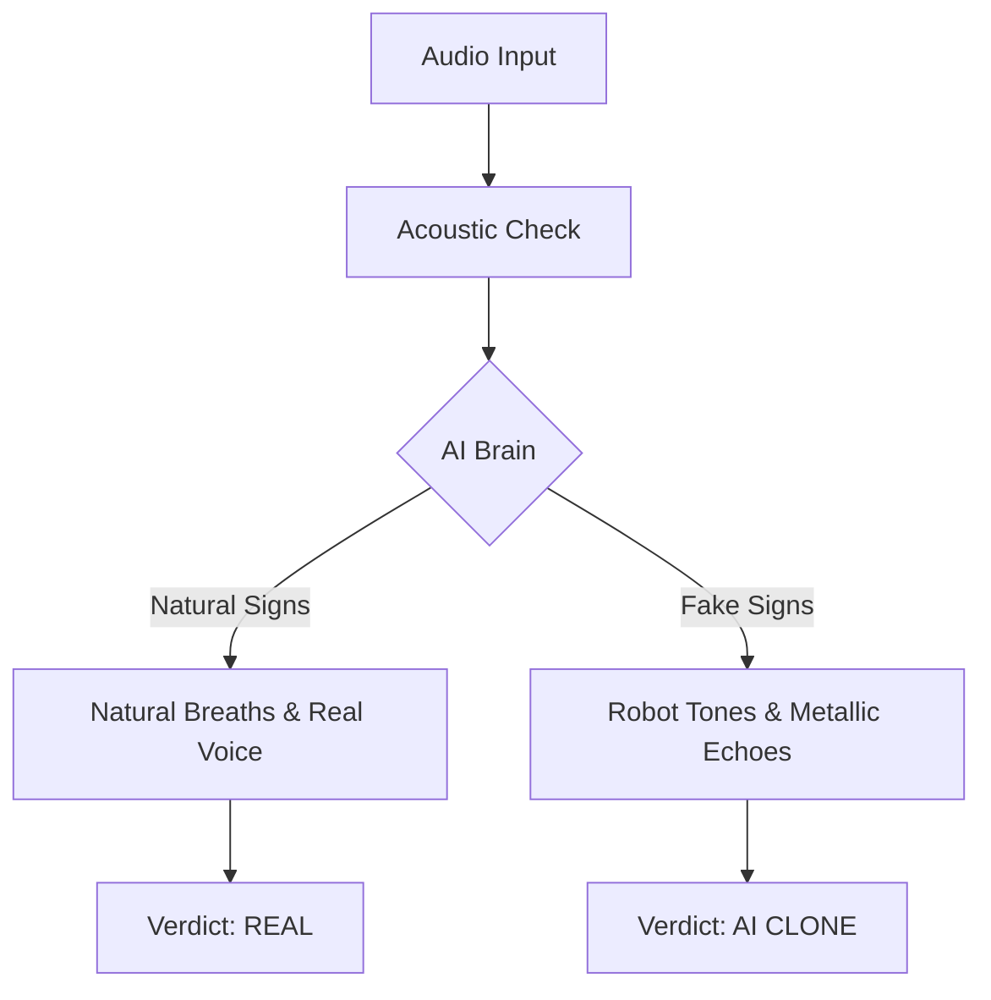

# 🧪 Proofy.ai — Professional Media Verification

Proofy is a simple but powerful tool for checking if videos, images, audio, and text are real or made by AI. It is built for professional use and deep inspection.


---

## 🏗 How it Works

Proofy works by talking directly to advanced AI to check your files quickly and accurately.



---

## 🚀 Main Features

Proofy is designed with these core capabilities:

-   **Full Media Uploads**: Check any video, image, audio clip, or block of text.
-   **Deep Video Analysis**: Watches videos frame-by-frame and flags exactly when a problem happens with **timestamp-level marking** (e.g., "Melted face at 0:15").
-   **Advanced Detection**: Finds specific problems like:
    -   **Lighting Errors**: Shadows that don't make sense.
    -   **Facial Warping**: Faces that "melt" or change shape unnaturally.
    -   **Motion Anomalies**: Objects that move in impossible ways.
    -   **AI Artifacts**: Strange "glitches" left behind by AI generators.
-   **Saved Results**: Every check is saved with a **confidence score** so you can review it later.

---

## 📽 Video Checking Flow



---

## 🎙 Audio & Sound Checking



---

## 🛠 How to Use It

### **Setting it up**
Add your API key to a file called `.env`:
```sh
VITE_API_KEY=your_key_here
```

### **Installation**
1.  Run `npm install`
2.  Run `npm run dev`
3.  Open the website in your browser!

---

## 📄 License
Professional Verification Protocol.
