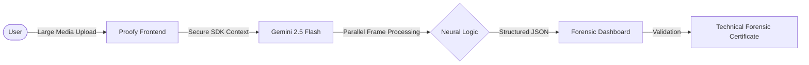
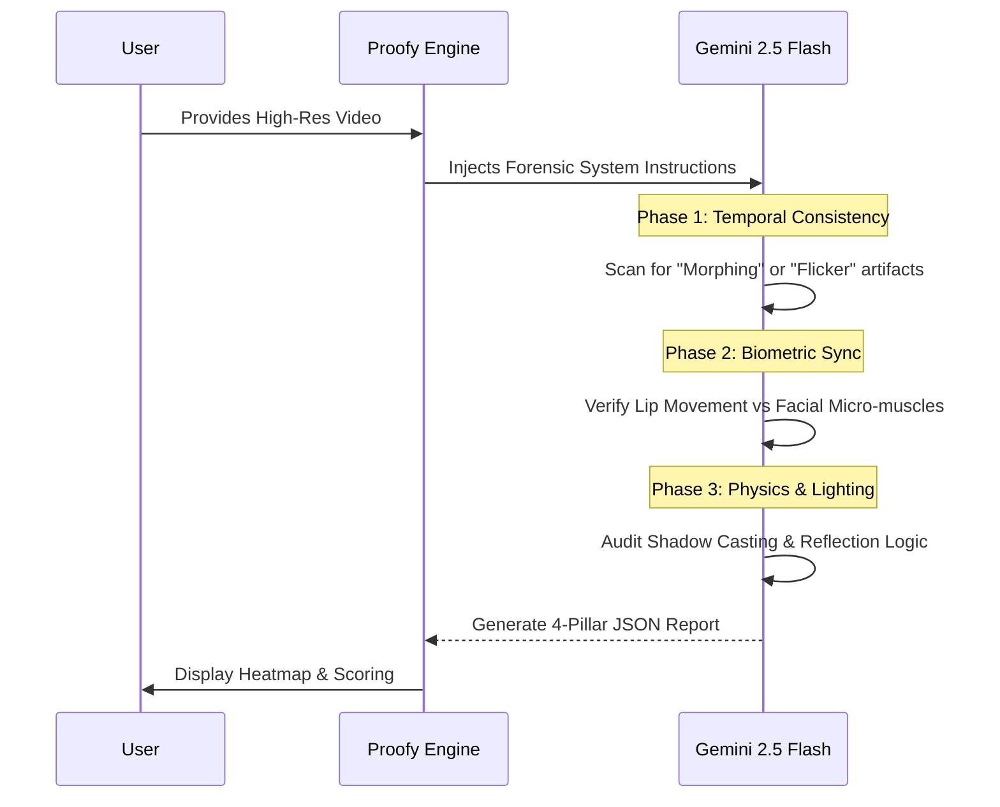

# 🧪 Proofy.ai — The Advanced Neural Forensic Suite

Proofy is a next-generation Forensic Truth Verification platform designed for the age of Neural Synthesis. By utilizing state-of-the-art Generative AI, Proofy interrogates digital artifacts to verify authenticity across Video, Audio, Text, and Code.


---

## 🏗 High-Level Architecture: "Direct-to-Cognition"

Proofy utilizes a unique **Direct-to-Cognition** architecture. Unlike traditional web apps that proxy AI requests through a bottlenecking backend, Proofy integrates the Gemini SDK directly into the client-side execution loop.

### **The Payload Advantage**
By bypassing the standard **4.5MB Vercel Serverless Payload Limit**, Proofy can analyze:
- **High-Definition Video**: Up to 40MB+ clips analyzed in a single pass.
- **Project Archives**: Entire ZIP files interrogated for structural integrity.
- **Raw Audio**: Uncompressed wav files for acoustic fingerprinting.



---

## 📽 Neural Video Forensic Analysis (Deep Dive)

Proofy does not simply "look" at pixels; it performs a **Frame-by-Frame Temporal Interrogation**. It is designed to distinguish between **Real-World Noise** (compression artifacts, low light) and **Synthetic Failures** (AI warping).

### **The Technical Interrogation Flow**


### **The Four Pillars of Video Forensics**
1.  **Integrity**: Distinguishes between standard H.264 compression blocks and AI-generated pixel-bleeding.
2.  **Consistency**: Analyzes lighting physics across frames to see if shadows move in a physically consistent vector.
3.  **AI Patterns**: Searches for "Neural Signatures" common in diffusion-based models (warping edges).
4.  **Temporal Logic**: Verifies that motion follows a continuous path without "teleporting" frames.

---

## 🎙 Acoustic Forensic Analysis

For audio, Proofy specializes in detecting **Artificial Voice Cloning** and **Synthetic Speech (TTS)**.

### **Technical Indicators for Audio Verification**
- **Phase Inconsistency**: Detecting "metallic" tints often found in early-stage voice clones.
- **Acoustic Fingerprinting**: Real humans have imperfect articulation and varied room tone; AI often has "perfectly consistent" pitch.
- **Natural Respiration**: Scanning for natural breath patterns which are often missing or "floating" in synthetic audio.

---

## 🗞 Truth Interrogator (Text & Claims)

The Truth Interrogator goes beyond simple sentiment analysis; it acts as a **Digital Fact-Checker**.

- **AI Content Detection**: Analyzes linguistic markers, perplexity, and burstiness to detect text generated by Large Language Models.
- **Grounded Fact-Checking**: Performs multiple "Search Queries" in the background to verify claims against live, reputable sources.
- **Source Verification**: Provides a list of verified URLs for every factual claim made in the text.

---

## 📦 ZIP Archive Architect

Analyze the skeleton of a software project in seconds. 
- **Stack Discovery**: Tells you exactly what technologies a project is built with.
- **Structural Audit**: Scans for "Red Flag" structures (unprotected keys, missing files, suspicious scripts).
- **Security Mapping**: Provides actionable security notes based on the project's file hierarchy.

---

## 🛠 Advanced Tech Stack

| Technology | Role | Version |
| :--- | :--- | :--- |
| **react** | UI Framework (High Performance) | `^19.2.4` |
| **@google/genai** | Direct Neural SDK Integration | `^1.40.0` |
| **framer-motion** | Smooth Dashboard Micro-animations | `11.11.17` |
| **three.js** | Neural Network Background Visuals | `0.170.0` |
| **lucide-react** | Clean Forensic Iconography | `0.460.0` |
| **Vite** | Blazing Fast Build Tooling | `^7.3.1` |

---

## ⚙️ Setup & Deployment

### **1. Environment Configuration**
Create a `.env` file in the root directory:
```bash
VITE_API_KEY=your_gemini_api_key_here
```

### **2. Installation & Run**
```bash
npm install
npm run dev
```

### **3. Vercel Hosting**
Proofy is pre-configured for Vercel. Simply push to your repository and ensure your `VITE_API_KEY` is added to the Environment Variables in your Vercel project settings.

---

## 📄 License & Safety
Proofy is a technical-grade tool. It is designed to **minimize false positives** by biasing towards "REAL" verdicts unless undeniable temporal or acoustic evidence of AI manipulation is detected.

> [!IMPORTANT]
> Use this tool as a supplement to professional human forensics. AI detection is a probabilistic science.
