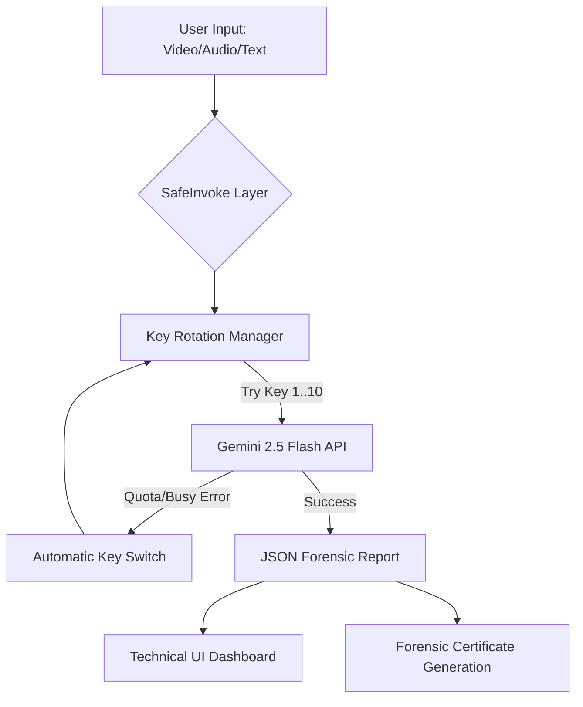

# 🧪 Proofy.ai — Truth Verification & Neural Forensic Suite

Proofy is a high-performance, resilient AI suite designed to interrogate digital media, verify claims, and conduct deep structural analysis of project archives. Built for speed and reliability, it leverages a **10-key rotating array** of Gemini Pro models to ensure near-zero downtime and massive throughput.


---

## 🏗 System Architecture & Flows

Proofy utilizes a **Vercel-Optimized Frontend-Only Architecture**. High-bandwidth media requests bypass traditional server bottlenecks, communicating directly with Google's Neural Engines.

### 🔄 The "Infinite Logic" Flow


---

## 🚀 Core Features

### 1. 🔍 Neural Forensic Engine (Media)
Analyze videos and audio for temporal inconsistencies, biometric anomalies, and AI-generated artifacts.
- **Deepfake Detection**: Frame-by-frame temporal analysis.
- **Biometric Consistency Check**: Lip-sync and facial movement logic.
- **Compression vs Synthesis Filter**: Minimizes false positives from low-quality real videos.

### 2. 🗞 Truth Interrogator (Text)
A grounded fact-checking engine that cites real-world sources.
- **AI Text Detection**: Linguistic marker analysis.
- **Fact-Check Mode**: Live Google Search grounding for claim verification.

### 3. 📦 ZIP Archive Architect
Analyze the structure of entire codebases from ZIP uploads.
- **Tech Stack Discovery**: Identify categories and technologies.
- **Security Audit**: High-level security notes on project structure.

### 4. 🤖 Forensic Assistant
An interactive AI agent designed for technical deep-dives and evidence interrogation.

---

## 🛠 Technical Specifications

### **The Multi-Key Resilient Engine**
Proofy implements a custom `safeInvoke` wrapper that provides astronomical uptime:
- **10-Key Rotation**: Seamlessly cycles through a pool of API keys if quota is reached.
- **Cooling Down Detection**: Detects "System Busy" or "Cooling Down" states and switches keys in < 500ms.
- **Model Fallback**: Automatically drops to stable models (`gemini-flash-latest`) if the primary Pro model is momentarily unavailable.

### **Tech Stack**
- **Frontend**: Vite + React 19 + Framer Motion
- **AI SDK**: `@google/genai` (Integrated Client-Side)
- **Visuals**: Three.js + React Three Fiber
- **Deployment**: Vercel (Optimized SPA)

---

## 📁 Project Structure

```text
proofy/
├── api/             # Structural Backend Shell (Historical)
├── components/      # Glassmorphism UI Components
├── services/        # Core AI Logic & Resilient Engine
│   ├── geminiService.ts  # Forensic Logic & Key Rotation
│   └── gemini.ts         # ZIP Analysis Engine
├── types.ts         # Global Forensic Data Structures
├── vite.config.ts   # Client-Side Security Configuration
└── vercel.json      # SPA Routing & Vercel Optimization
```

---

## ⚙️ Setup & Environment

To run Proofy locally, create a `.env` file in the root:

```sh
# Add up to 10 keys separated by commas for rotation
VITE_GEMINI_KEYS=key1,key2,key3,key4,key5,key6,key7,key8,key9,key10
VITE_API_KEY=primary_key_here
```

### Installation
```bash
npm install
npm run dev
```

---

## 📄 License
Custom Forensic License - Professional Use Only.
