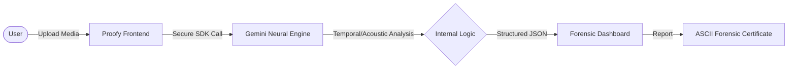

# 🧪 Proofy.ai — Truth Verification & Neural Forensic Suite

Proofy is a next-generation Forensic Truth Verification Suite. It leverages advanced Neural Engines to interrogate digital media, detect deepfakes, verify textual claims, and audit code project structures.


---

## 🏗 High-Level Architecture

Proofy uses a **Direct-to-Cognition** architecture. By utilizing the Gemini SDK directly in the browser, Proofy bypasses traditional server-side payload limits, allowing for the analysis of high-resolution, large-scale video and audio files without compression loss.



---

## 📽 Neural Video Forensic Analysis

Proofy performs a **Frame-by-Frame Temporal Interrogation** of video files. Unlike simple pixel-scanning, Proofy analyzes the **motion logic** and **temporal consistency** of the media.

### **The Video Analysis Flow**


### **Technical Indicators**
- **Temporal Failure Detection**: Identifying "flickering" or "warping" that occurs only for split-seconds in AI motion.
- **Biometric Calibration**: Checking if lip movements align with micro-muscle activations in the face.
- **Physics Break Analysis**: Scanning for shadows or reflections that do not follow physical laws.

---

## 🎙 Acoustic Forensic Analysis

For audio media, Proofy specializes in detecting **Artificial Voice Cloning** and **Synthetic Speech (TTS)**.

### **The Audio Analysis Flow**


---

## 🚀 Key Features

### 🔍 Media Forensics
- **Deepfake Detection**: High-accuracy scanning for neural synthesis.
- **Manipulation Mapping**: Identifying exactly *where* and *when* a video was likely altered.

### 🗞 Truth Interrogator (Text)
- **AI Text Detection**: Forensic linguistic analysis to detect LLM-generated patterns.
- **Grounded Fact-Checking**: Verification of claims using live Google Search grounding.

### 📦 ZIP Archive Architect
- **Structural Analysis**: Deep-scan of project folders to identify technologies and potential security risks.

### 🤖 Forensic Assistant
- **Evidence Interrogation**: Use the integrated assistant to ask technical questions about analysis results or forensic concepts.

---

## 🛠 Tech Stack
- **Engine**: Gemini 2.5 Flash (Neural Pro Model)
- **Frontend**: Vite + React 19 + Framer Motion
- **Visuals**: Three.js (Neural Network Backgrounds)
- **Deployment**: Vercel (Edge-Optimized)

---

## ⚙️ Setup

To run Proofy locally, set your API key in a `.env` file:

```sh
VITE_API_KEY=your_gemini_api_key_here
```

### Installation
```bash
npm install
npm run dev
```

---

## 📄 License
Forensic Grade Security Protocol. Professional use only.
